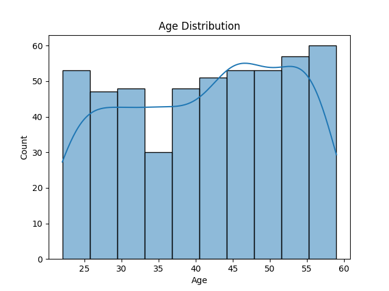
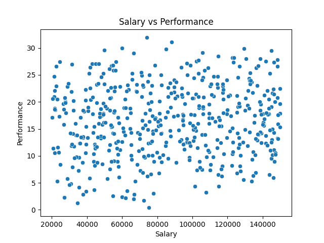
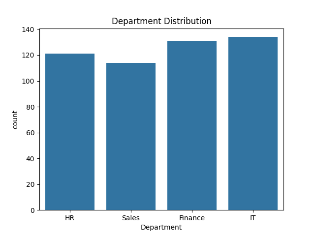
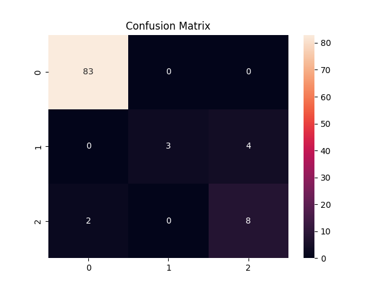

# 📊 Employee Performance Predictor using Data Analytics

## 📌 Overview
The Employee Performance Predictor is a Machine Learning project that analyzes employee-related data and predicts performance levels (High, Medium, Low).  
It simulates how companies use data analytics to support HR decision-making.

---

## 🎯 Problem Statement
Organizations often struggle to evaluate employee performance objectively.  
This project builds a predictive model using data analytics to classify employee performance based on various factors.

---

## 💼 Business Use Cases
- Identify high-performing employees  
- Detect underperforming employees early  
- Support promotion and appraisal decisions  
- Improve employee training strategies  
- Assist HR in workforce planning  

---

## ⚙️ Project Workflow

Data Generation → Data Preprocessing → EDA → Model Training → Prediction → Evaluation → Insights

---

## 🛠️ Tech Stack
- Python  
- Pandas  
- NumPy  
- Matplotlib  
- Seaborn  
- Scikit-learn  

---

## 📂 Project Structure

Employee-Performance-Predictor/
│
├── data/ 
├── outputs/ 
│ ├── confusion_matrix.png
│ ├── age_distribution.png
│ ├── salary_vs_performance.png
│ └── department_distribution.png
│
├── main.py 
├── requirements.txt 
└── README.md

---

## 🔍 Features
- Synthetic HR dataset generation  
- Data preprocessing and cleaning  
- Exploratory Data Analysis (EDA)  
- Machine Learning model (Random Forest)  
- Performance prediction  
- Visualization of insights  

---

## ▶️ How to Run the Project

### 1. Clone the repository

git clone <your-repo-link>
cd Employee-Performance-Predictor

### 2. Install dependencies

pip install -r requirements.txt

### 3. Run the project

python main.py

---

## 📊 Output

 
 
 
 

---

## 🧠 Machine Learning Model
- Algorithm Used: Random Forest Classifier  
- Type: Classification  
- Evaluation Metrics:
  - Accuracy Score  
  - Confusion Matrix  
  - Classification Report  

---

## 🚀 Future Improvements
- Use real-world HR datasets  
- Add Streamlit dashboard  
- Deploy model as web app  
- Add employee attrition prediction  
- Perform hyperparameter tuning  

---

## 👨‍💻 Author
Bujja Karthik

---

## ⭐ Acknowledgment
This project is built for learning and demonstrating practical applications of Data Science in HR Analytics.

---

## 📌 Note
This project uses synthetic data for demonstration purposes and does not represent real employee data.